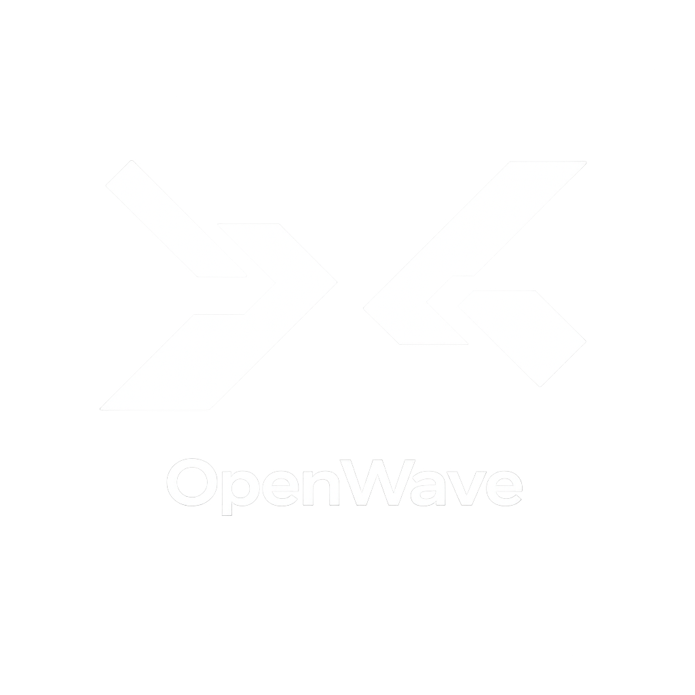

<p align="center">
  
</p>

<p align="center">
  <strong>An open, local-first agent runtime for real work.</strong><br>
  The engine behind a production research platform, rebuilt in Rust to run on your machine with your own model keys.
</p>

<p align="center">
  
  
  
  <a href="https://github.com/brightwave-inc/openwave/releases/latest"></a>
</p>

<p align="center">
  <a href="https://github.com/brightwave-inc/openwave/releases/latest/download/OpenWave-macos-apple-silicon.dmg"></a>
</p>

---

> [!WARNING]
> **Early and in active development.** OpenWave is being built in the open, one
> slice at a time. Interfaces, schema, and crate layout change frequently, and
> it isn't ready for real-world use yet. Star the repo to follow along — and
> expect rough edges.

## Download

The desktop app ships for macOS, signed and notarized. The two links above
always resolve to the newest release; the
[releases page](https://github.com/brightwave-inc/openwave/releases) has the
notes and earlier versions. An installed build keeps itself current — it checks
for a newer signed release in the background and asks before restarting.

Each download has a `.sha256` sidecar on the same release if you want to verify
it:

```sh
shasum -a 256 -c OpenWave-macos-apple-silicon.dmg.sha256
```

There are no Windows or Linux builds yet; on those platforms, build from source
as described under [Building](#building).

## Where this comes from

Since 2024 we've built [Brightwave](https://brightwave.io), a research platform
for financial diligence. Hundreds of finance professionals use it for work they
put their name on, where a missed detail in a data room has real consequences
and every claim has to trace back to a source.

Running it in production taught us some things. The agent loop is the easy
part; the hard part is what happens when a tool call fails halfway through a
twenty-step task. Sandboxing has to be there from the start. And a user who
can't switch models is stuck with their vendor's outages and their vendor's
pricing.

OpenWave is that engine rebuilt in Rust: the agent loop, the tool model,
sandboxed execution, connectors, and permissions. Apache-2.0, local-first, and
complete on its own.

## What we believe

**The engine that does the work should belong to you.** Not a cloud service
that holds your data and meters your tokens. Files stay on your machine, keys
stay in your keychain, code runs sandboxed, and the agent asks before it
reaches past what you've granted. Those aren't features; they follow from the
first sentence.

**A conversation shouldn't care which vendor is on the other end.** So the
journal is provider-neutral and you can switch providers mid-chat, from Claude
to GPT to a local model, and keep going. The day your provider has an outage
and your work doesn't stop, that's the principle paying off.

**Software should work before it asks you to configure it.** OpenWave runs on
first launch with sensible defaults. Every layer underneath: models, sandboxes,
tools, and permissions can be swapped out when you need to, and not before.

**The work is the point.** Demos optimize for the first five minutes. We
optimize for whether the deliverable got done.

## Status

Pre-alpha, built in the open. The current product is conversation-first: each
chat is its own workspace, with exact conversation-scoped sources rather than a
shared fallback corpus. Sources can be added from the composer and read directly
after synchronous text decoding, with model-authored citations. Foreground
agents can also create bounded text deliverables that remain private to the
conversation until the user previews and explicitly exports them from the
native Outputs view. The stack includes local file tools, multi-provider model
routing, a turn engine with live journaled WebSocket events, a workspace-style
desktop conversation shell, a bounded foreground/sandbox agent-run foundation,
and durable synchronous source ingestion and reading — all behind
`openwave serve`.
Project records and APIs remain dormant for compatibility and future design
work, but Projects are not surfaced in the desktop and are not required to
start working.

See [`docs/deliverables.md`](docs/deliverables.md) for the generated-output and
native export boundary.

Connectors, richer document parsers, indexed-search MCP wiring, and MCP
configuration UI remain in development. Expect rapid change and rough edges —
and see [CONTRIBUTING](CONTRIBUTING.md) if you'd like to help.

## Building

```sh
cargo build --workspace
cargo test --workspace
```

Requires the Rust toolchain declared in [`rust-toolchain.toml`](rust-toolchain.toml).

### Desktop app (Tauri)

The desktop shell lives in [`crates/openwave-desktop`](crates/openwave-desktop).
It boots the same local API as `openwave serve` inside the process and hosts a
React UI in a webview. See that crate's README for prerequisites and the two
local-test paths (`cargo tauri dev`, or browser UI against `openwave serve`).

Headless API without the UI:

```sh
ANTHROPIC_API_KEY=sk-... cargo run -p openwave-cli -- serve
# then: curl -s http://127.0.0.1:PORT/healthz
#       curl -H "Authorization: Bearer TOKEN" http://127.0.0.1:PORT/chats

# MCP stdio server confined to an explicit workspace (read_file + list_dir):
cargo run -p openwave-cli -- mcp /absolute/path/to/workspace
```

### External MCP servers

Both `openwave serve` and the desktop app can mount external stdio MCP servers
at startup. Set `OPENWAVE_MCP_CONFIG` to a JSON file:

```json
{
  "servers": [
    {
      "name": "private_docs",
      "command": "/absolute/path/to/docs-mcp",
      "args": ["--stdio"],
      "env": { "LOG_LEVEL": "info" },
      "env_from": ["DOCS_TOKEN"],
      "cwd": "/srv/docs",
      "request_timeout_ms": 60000
    }
  ]
}
```

```sh
OPENWAVE_MCP_CONFIG=/absolute/path/to/mcp.json \
  cargo run -p openwave-cli -- serve
```

Commands are executed directly, without a shell. Each server receives only its
configured literal `env` and the parent variables explicitly named by
`env_from`, so use an absolute command path. A missing `env_from` variable fails
startup; set `"inherit_env": true` only when the server must inherit OpenWave's
entire process environment. Prefer `env_from` for credentials so they need not
be stored in JSON. Treat the file as sensitive and restrict its filesystem
permissions if it does contain credentials. Startup fails if a configured
server cannot initialize. Its discovered tools are named
`mcp__{server}__{tool}` and always cross the sensitive-tool approval boundary.

## Layout

This is a single Cargo workspace. Libraries never depend on clients — the
dependency graph only flows downward toward `openwave-core`. For a fuller
walkthrough of each crate, see [`docs/crates.md`](docs/crates.md). For an
end-to-end, less technical tour of the runtime and its state machines, see
[`docs/how-openwave-works.md`](docs/how-openwave-works.md). The planned shared
foreground/background execution model is described in
[`docs/agent-runs.md`](docs/agent-runs.md).

| Crate | What it is |
| --- | --- |
| [`openwave-core`](crates/openwave-core) | agent loop, tools, event stream, storage traits |
| [`openwave-router`](crates/openwave-router) | Anthropic, OpenAI, xAI, Gemini, and compatible providers + model routing |
| [`openwave-code-execution`](crates/openwave-code-execution) | provider-neutral command execution + native local sandbox |
| [`openwave-server`](crates/openwave-server) | authenticated local HTTP/WebSocket API + durable workers |
| [`openwave-connectors`](crates/openwave-connectors) | OAuth + source connectors |
| [`openwave-mcp`](crates/openwave-mcp) | lifecycle-gated MCP server plus external stdio client tool mounting |
| [`openwave-desktop`](crates/openwave-desktop) | desktop app (Tauri) |
| [`openwave-cli`](crates/openwave-cli) | headless `openwave serve` + `openwave mcp` commands |

## License

Apache-2.0 — see [LICENSE](LICENSE) and [NOTICE](NOTICE). Contributions are
accepted under the terms in
[CONTRIBUTING](CONTRIBUTING.md#contributor-license-agreement).
