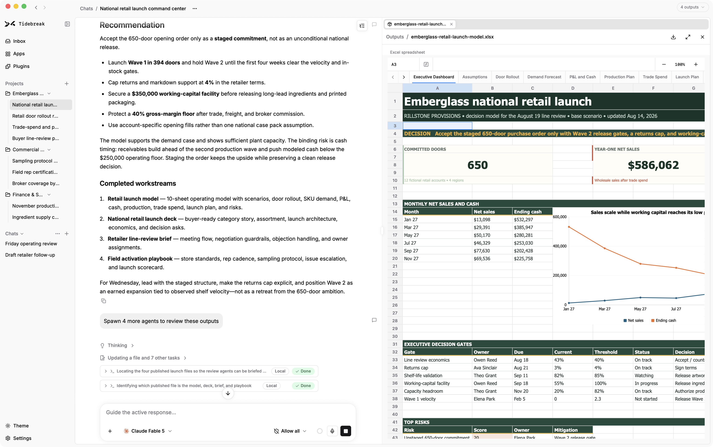

<p align="center">
  <br>
  
</p>

<h1 align="center">Tidebreak</h1>

<p align="center">
  <strong>A local-first agentic coworker you can configure without limit. Choose your files and model. Walk away with a spreadsheet, deck, or working app.
</p>

<p align="center">
  <a href="https://www.tidebreak.io">Website</a> ·
  <a href="https://www.tidebreak.io/docs/">User documentation</a> ·
  <a href="https://github.com/brightwave-inc/tidebreak/releases/latest">Latest release</a> ·
  <a href="CONTRIBUTING.md">Contributing</a>
</p>

<p align="center">
  
  
  
  <a href="https://github.com/brightwave-inc/tidebreak/releases/latest"></a>
</p>

<p align="center">
  <a href="https://github.com/brightwave-inc/tidebreak/releases/latest/download/Tidebreak-macos-universal.dmg"></a>
  <a href="https://github.com/brightwave-inc/tidebreak/releases/latest/download/Tidebreak-windows-x86_64-setup.exe"></a>
  <a href="https://github.com/brightwave-inc/tidebreak/releases/latest/download/Tidebreak-linux-x86_64.AppImage"></a>
  <a href="https://github.com/brightwave-inc/tidebreak/releases/latest/download/Tidebreak-linux-x86_64.deb"></a>
</p>

<p align="center">
  <picture>
    <source media="(prefers-color-scheme: dark)" srcset="assets/tidebreak-hero-dark.png">
    
  </picture>
</p>

---

Tidebreak is a local-first desktop agent for work that ends in a file, not just
a chat response. It can read attached documents, work in explicitly connected
folders, run code in a sandbox, search the web, delegate parallel jobs, and
publish anything it creates as a versioned output. An experimental code mode
turns the same supervision onto software work: it drives coding agents such as
Claude Code in isolated git worktrees, with native approvals and per-turn
diffs.

You choose the model route: Anthropic, OpenAI, Google, xAI, OpenRouter, a local
Ollama daemon, or another OpenAI-compatible endpoint. Conversations can switch
providers without starting over. Credentials stay in the operating system's
credential store, while chats and outputs remain in the local Tidebreak
profile.

The [website](https://www.tidebreak.io) is the product overview. The
[user documentation](https://www.tidebreak.io/docs/) covers installation,
configuration, permissions, connected folders, code execution, outputs, and
the headless CLI.

> [!WARNING]
> Tidebreak is pre-1.0 and changing quickly. Interfaces and local data formats
> may change between releases, and profiles may be rebuilt rather than
> migrated. Windows and Linux packages ship for x86_64, with ARM64 builds on
> the way; some native capabilities
> remain macOS-only and are reported as unavailable in the app.

## Features

| Area | What it does |
| --- | --- |
| **Chat** | Voice input, local or cloud. Queue a follow-up or steer the live turn. `@` attaches files and folders; `/` attaches a skill or saved prompt. Turns, approvals, and questions survive a restart. An inbox collects anything waiting on you. |
| **Documents** | Attach any file. Office, PDF, images, and text open in native viewers; other formats fall back to extracted text when they can be read. Source pills jump to the page, line, sheet, or cell. No vector index: the agent reads bounded ranges directly. |
| **Outputs** | Files written to `output/` are versioned by filename. Restore is append-only. Plotly charts stay interactive. The agent can write back into a connected folder; replacing an existing file always asks. |
| **Models** | ChatGPT Plus or Pro, an API key (Anthropic, OpenAI, Gemini, xAI, Fireworks, Together, OpenRouter), or a local OpenAI-compatible endpoint including Ollama. Switch mid-chat. Keys stay in the OS credential store. |
| **Execution** | Native macOS sandbox, local Docker, E2B, or Daytona. Per-chat network policy. Background agents one level deep. Built-in or configured web search (Exa, Tavily, Brave, SearXNG). Computer use: screen capture and consent-gated control of native apps. |
| **Permissions** | Plan, Ask, Auto, or Allow all, per chat. Folder access is per capability from a native picker. Standing grants are revocable. Overwrite of a connected file always asks. |
| **Extensions** | Built-in skills for Word, PDF, PowerPoint, spreadsheets, and charts; add your own. MCP servers over stdio or HTTP. REST APIs from an OpenAPI document, for local apps. Ask once for a mini-app and keep it in the sidebar. |
| **Code mode** | Experimental. A second surface that drives coding agents (Claude Code, Codex CLI, opencode, Grok CLI) in isolated git worktrees: native approvals, per-turn diffs, and a reviewable change flow. |

## Run from source

Install the pinned Rust toolchain, [pnpm](https://pnpm.io), the
[Tauri 2 prerequisites](https://v2.tauri.app/start/prerequisites/), and CMake
(used by the local voice engine). Then, from the repository root:

```sh
scripts/dev.sh
```

That installs the desktop UI dependencies and opens the app. See
[`CONTRIBUTING.md`](CONTRIBUTING.md#development) for formatting, tests, and
platform notes, or
[`crates/tidebreak-desktop/README.md`](crates/tidebreak-desktop/README.md) for
the native and browser-based UI workflows.

The headless server uses the same core runtime:

```sh
ANTHROPIC_API_KEY=sk-... cargo run -p tidebreak-cli -- serve
```

See the [headless documentation](https://www.tidebreak.io/docs/headless/) for
one-shot mode, HTTP API, MCP server, configuration, and self-hosting.

## Repository guide

| Path | Purpose |
| --- | --- |
| [`crates/`](crates) | Rust workspace: agent runtime, providers, server, CLI, sandboxing, MCP, and desktop host |
| [`crates/tidebreak-desktop/ui/`](crates/tidebreak-desktop/ui) | React frontend embedded by the Tauri desktop app |
| [`docs-site/`](docs-site) | Source for the public user documentation |
| [`docs/`](docs) | Maintainer architecture, contracts, operations, plans, and decision records |
| [`skills/`](skills) and [`plugins/`](plugins) | Bundled artifact skills and plugin manifests |
| [`deploy/self-host/`](deploy/self-host) | Self-host deployment assets |

Start with [`docs/how-tidebreak-works.md`](docs/how-tidebreak-works.md) for an
end-to-end technical tour or [`docs/crates.md`](docs/crates.md) for the
workspace map. [`docs/README.md`](docs/README.md) indexes the rest of the
maintainer documentation.

## Contributing

Tidebreak is built in the open. Bug reports, focused fixes, and design
discussion are welcome. Read [`CONTRIBUTING.md`](CONTRIBUTING.md) before
opening a substantial change. Decisions that future work must preserve live in
[`docs/decisions/`](docs/decisions).

## License

Apache-2.0. See [`LICENSE`](LICENSE), [`NOTICE`](NOTICE), and the
[contributor license agreement](CONTRIBUTING.md#contributor-license-agreement).
